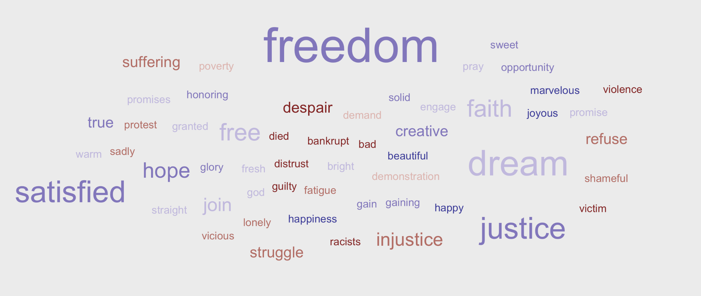

## Day One

On July 11th, 1977, #MLK was presented with the Presidential Medal of Freedom. We have an three part #rstats challenge to commerate that day. Day One: Using #rvest and #tidyverse, scrape the I Have a Dream speech text into a 29 row #tibble (one per paragraph) from https://aol.it/2NFuaum #tidytuesday

## Day Two

Perform the following #tidytext steps: 

1. Unnest words
2. Remove stop words
3. Append `afinn` word sentiment #rstats

## Day Three

Using #dplyr, 

1. Count the occurrence of each word (maintaining the afinn score)
2. Remove any word with an NA afinn score
3. Use #ggwordcloud to produce this wordcloud shown!



## Suggested Libraries

```
library(rvest)
library(tidyverse)
library(tidytext)
library(hunspell)
library(ggwordcloud)
```
